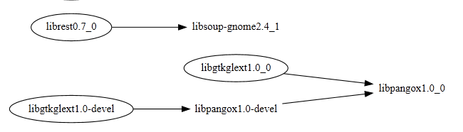

When you try to uninstall stuff from Cygwin, it might present you with a list of other packages which claim to depend on what you're uninstalling. If you're trying to uninstall a bunch of packages, it can get pretty confusing as to what depends on what and where the dependency chain actually starts.

This script reads such a list, and generates a graph that shows the dependencies among the listed packages, which could help you decide which ones you want to go back and add to the Uninstall list, and which of the to-be-uninstalled stuff you want to keep after all.

Requirements: [GraphViz](http://graphviz.org) with `dot.exe` in your PATH, [GraphViz Perl module on CPAN](https://metacpan.org/pod/release/LBROCARD/GraphViz-2.04/lib/GraphViz.pm), and of course Perl itself.

A trivial example case:

```
libpangox1.0-devel	(0.0.2-1)
	Deprecated PangoX library
	Required by: libgtkglext1.0-devel

libsoup-gnome2.4_1	(2.48.1-1)
	GNOME HTTP library
	Required by: librest0.7_0

libpangox1.0_0	(0.0.2-1)
	Deprecated PangoX library
	Required by: libgtkglext1.0_0, libpangox1.0-devel

```

turns into



Usage: Just run it as `perl ./cygdepparser.pl` with the input data in a file named input.txt in the current directory. The output is in an SVG file `cyg_dependency.svg`, that you can view in any modern browser.
You can also do `perl ./cygdepparser.pl yourfilename.txt`, in which case the output is put into `yourfilename.svg` in the same directory.

TODO: There's tons of prettification that GraphViz has features for, so the output can probably be made to look more appealing, and perhaps be more usable too.

